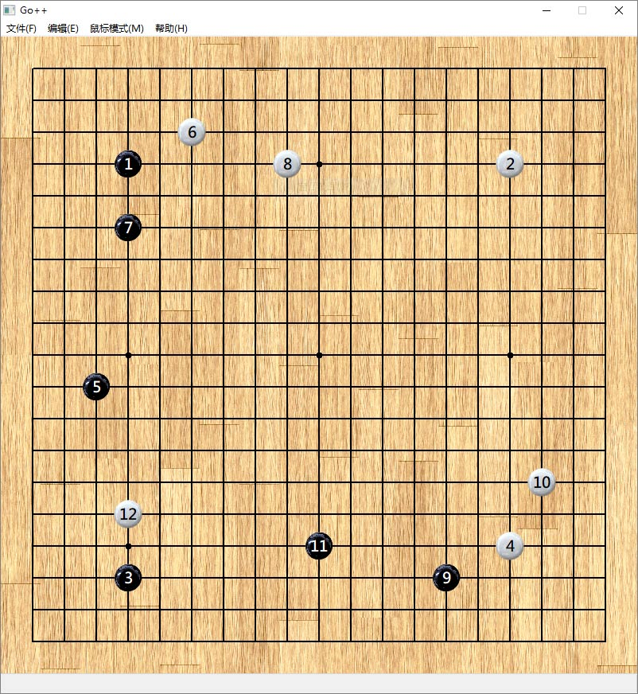
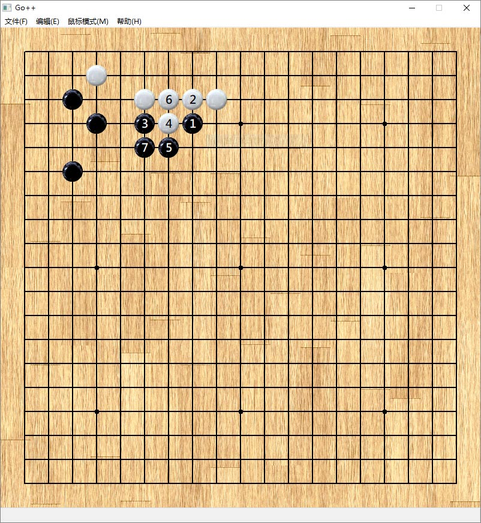

# GoPlusPlus

围棋，用于记谱或实验。

## 软件依赖

这个程序当前依赖于`wxWidgets`，编写时的环境为3.1.0，要正确编译，您可能需要`wxWidgets 3.0`以上的版本。

## 软件语言

中文，当前没有添加其他语言支持的计划。

## 开发语言

`C++`，编写时使用的编译器是g++ (x86_64-posix-seh-rev0, Built by MinGW-W64 project) 7.2.0。  
由于编写时假设环境支持`C++17`标准，当使用不支持`C++17`的编译器时，将可能发生奇怪的错误。

## 运行平台

Windows/Linux/MacOS，一切有支持C++17编译器的平台。  
当前的`Makefile`是为Windows平台编写的，您可以很容易地改成适用于其他平台的版本。

## 下载并使用

下载适用于Windows的[Github发布包](https://github.com/Krantz-XRF/GoPlusPlus/releases/tag/v1.0)。

## 编译指南（Makefile修改指南）

### 需要修改的字段

变量`CXXFLAGS`中有`wxWidgets`的所在目录。

变量`CXXFLAGS`中，为使Windows下中文不乱码，有`-fexec-charset=GBK`，在支持`UTF-8`的平台，您应该将其去除。

变量`LINKFLAGS`中，含有Windows下的各`WinAPI`库，在非Windows平台下，您应该将其去除。

### 命令的替换

这个`Makefile`使用了指令`rm`，在Windows平台下，您应该安装`MSYS`或`Cygwin`以支持该指令。否则，您应该将其替换为del。

### 有关资源文件

为Windows平台下的方便，涉及的所有图片都以资源的形式插入可执行文件中。  
在不支持资源的非Windows平台，您应当去掉`rc`文件的编译和链接，然后把对应的图片放在编译出的可执行文件路径下。

## 运行截图

  
图1 新棋局的编辑  
图中为中国流布局的一种变化。  
  
  
图2 打开已保存的棋局并继续编辑  
注意：这种情况下，您将不能撤销到未标序号的那些棋步。  
